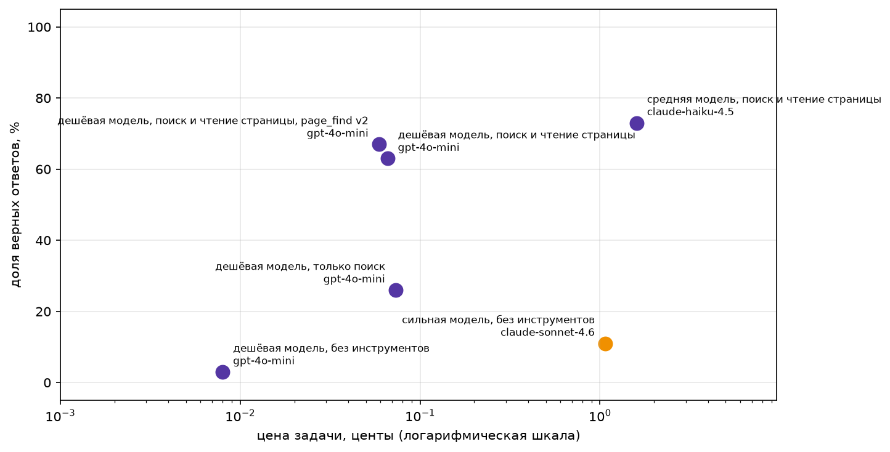

# Домашнее задание 1. Свежие вопросы и агент

## Что сделано

- **Набор** `data/fresh.jsonl`: 150 вопросов о событиях 2026 года из обзорных статей англоязычной Википедии («2026 in Japan», «2026 in science» и т.п.). 125 из стартового набора семинара плюс 25 своих (fresh-125…149, `source: own`) по странам и темам, которых в стартовом наборе не было. Ответ дословно есть в `evidence`, `evidence` дословно есть на странице `url`.
- **Проверка свежести** `python check_fresh.py data/fresh.jsonl --sonnet`, вывод целиком (`traces/check_fresh_output.txt`):

  ```
  записей: 150, проблем: 0

  Sonnet без инструментов: 1 из 150 верно, 1%. Потрачено $0.254
  критерий свежести пройден
    fresh-20: In the 2026 FIFA World Cup, what format was used for the knockout stage starting June 28? -> The Round of 32 (single-elimination knoc
  ```
- **Агент** ReAct на OpenRouter: инструменты `web_search` (семинар), `page_find` (полный текст статьи, строки с ключевыми словами, отсортированные по числу совпадений), `calculator`, `python_exec`; `max_steps`, детектор повторов, мягкое завершение, леджер, трейс каждого прогона в JSON.
- **Замер** на всех 150 вопросах в шести конфигурациях, таблица `report` и картинка `money_chart`.

## Как запустить

```
python -m venv .venv && source .venv/bin/activate
pip install -r requirements.txt
cp .env.example .env                       # вписать OPENROUTER_API_KEY
python -m pytest -q tests                  # 23 теста, для Википедии нужен интернет
python check_fresh.py data/fresh.jsonl --sonnet
python run_homework.py --workers 4         # все конфигурации, около 2 часов и $4
python make_report.py results/results_raw.csv
```

`run_homework.py` по умолчанию продолжает существующий `results/results_raw.csv` и дописывает только недостающие строки, `--restart` начинает заново, `--limit 10` для пробного прогона, `--plan "cheap:поиск" --suffix " v2"` для одной конфигурации под своим именем. У новых аккаунтов OpenRouter лимит 20 запросов в минуту на модель, клиент ждёт сброса сам, больше 4–6 потоков не нужно.

## Как сделано

Код ноутбука семинара перенесён в пакет `src/` по слоям:

```
src/config.py      Settings: ключ из .env или Kaggle Secrets, пути, MODELS
src/llm/           Ledger, LLMClient (ретраи, ожидание сброса лимита 429, жёсткий дедлайн на запрос), схемы, ask_structured
src/tools/         ToolRegistry, calculator, web_search, page_find, python_exec
src/agent/         Agent: цикл ReAct, Run, show_trace
src/evaluation/    load_tasks, is_correct, final_answer, Experiment (параллельный прогон, трейсы, tqdm), report, Cascade
src/viz/           графики, в том числе money_chart
run_homework.py    прогон конфигураций, продолжает прерванный; make_report.py собирает таблицу и картинку
tests/             23 теста: каждый инструмент на трёх случаях (нормальный вход, пустой результат, ошибка) и проверка ответа
```

Изменения в `is_correct` для свежих вопросов, GSM8K не тронут: даты принимаются в обоих порядках (`15 March` и `March 15`), числа словами в эталоне переводятся в цифры (`Forty-one` → `41`), совпадение ищется по границам слов, а не подстрокой (`2` не засчитывается в `2026`). Осталось ложным отказом: `38.0 °C` против `38 °C`, `BYD` против `BYD Auto`, `Alexeyev` против `Alekseyev`.

## Результаты

| Конфигурация | Модель | accuracy | cost_per_task, $ | cost_per_correct, $ | avg_steps | avg_seconds |
|:--|:--|--:|--:|--:|--:|--:|
| сильная модель, без инструментов | claude-sonnet-4.6 | 0.11 | 0.01068 | 0.10015 | 1.00 | 13.2 |
| дешёвая модель, без инструментов | gpt-4o-mini | 0.03 | 0.00008 | 0.00237 | 1.00 | 2.1 |
| дешёвая модель, только поиск | gpt-4o-mini | 0.26 | 0.00073 | 0.00279 | 5.27 | 64.9 |
| дешёвая модель, поиск и чтение страницы | gpt-4o-mini | 0.63 | 0.00066 | 0.00105 | 4.32 | 55.0 |
| дешёвая модель, поиск и чтение страницы, page_find v2 | gpt-4o-mini | 0.67 | 0.00059 | 0.00088 | 4.00 | 56.4 |
| средняя модель, поиск и чтение страницы | claude-haiku-4.5 | 0.73 | 0.01601 | 0.02204 | 4.19 | 69.6 |



Файлы: `results/results.md`, `results/results_all.csv` (900 строк, по одной на задачу и конфигурацию), `img/homework.png`. «v2» это тот же агент после починки `page_find` (см. провалы); Haiku прогнана с первой версией, повторный прогон не делался из-за бюджета. Сильная модель одним вызовом без инструментов, но с промптом агента «дай самый вероятный ответ», поэтому 11 %, а не 1 % как в `check_fresh.py`, где схема позволяет ответить `unknown`. Строки без инструментов и «только поиск» прогонялись дважды, в таблице второй прогон: в первом у Sonnet было 16 %, у gpt-4o-mini 1 %, это масштаб шума между прогонами.

**Вывод.** Тезис курса на этом наборе подтверждается: дешёвый агент с поиском и чтением страницы отвечает на 63–67 % вопросов при 0.09–0.1 цента за верный ответ, сильная модель без инструментов на 11 % при 10 центах за верный ответ. Средняя модель с теми же инструментами точнее (73 %), но её верный ответ в 25 раз дороже. Только поиск без чтения страницы почти не помогает (26 %). Оговорка: у обоих агентов 7–10 провалов из 40–50 это верные ответы в другой форме, реальная точность строк с инструментами на 5–7 пунктов выше табличной.

## Трейсы и провалы

Трейсы итогового прогона лежат в `traces/<конфигурация>/<модель>/<id>.json`: задача, конфигурация, ответ, вердикт, цена, шаги и вся история сообщений с вызовами инструментов.

Провалы лучшего дешёвого агента (v2, 49 из 150): 28 нашёл не то и ответил уверенно, 11 не нашёл и сдался, 7 ответ верный, но не прошёл проверку, 4 нашёл отдельную статью о событии, где число погибших отличается от обзорной страницы (Википедия противоречит сама себе). У Haiku (41 провал): 23 сдалась, 10 не прошли проверку, 6 другой источник, 2 нашла не то.

Два разобранных провала:

1. [`traces/поиск + страница/gpt-4o-mini/fresh-142.json`](traces/поиск%20%2B%20страница/gpt-4o-mini/fresh-142.json): нашёл, но модель не прочла. `page_find("2026 in chess", "GCT Super Chess Classic Romania May")` возвращал все строки с любым из слов, слова `Chess` и `May` есть почти везде, лимит 5000 символов срезал нужную строку. После сортировки строк по числу совпавших слов (v2) вопрос решён за 3 шага.
2. [`traces/поиск + страница/gpt-4o-mini/fresh-140.json`](traces/поиск%20%2B%20страница/gpt-4o-mini/fresh-140.json): поиск не нашёл. Семь запросов подряд возвращали статью «Sagittarius A*», агент ни разу не открыл «2026 in science» через `page_find`, где факт лежит одной строкой.


## Цена и токены

| | Sonnet 4.6, без инстр. | gpt-4o-mini, без инстр. | gpt-4o-mini, поиск | gpt-4o-mini, поиск+стр. | gpt-4o-mini, v2 | Haiku 4.5, поиск+стр. | Итого |
|:--|--:|--:|--:|--:|--:|--:|--:|
| вызовов модели | 150 | 150 | 753 | 632 | 581 | 612 | 2878 |
| входных токенов, оценка | 40k | 40k | 860k | 750k | 650k | 760k | ≈3.1M |
| выходных токенов, оценка | 74k | 10k | 12k | 11k | 9k | 29k | ≈145k |
| цена, $ | 1.60 | 0.01 | 0.11 | 0.10 | 0.09 | 2.40 | 4.31 |

Цены точные, из поля `usage.cost` OpenRouter в каждом трейсе. Токены оценены по трейсам (4 символа на токен, контекст пересылается на каждом шаге): леджер с точными `usage` жил в памяти процесса и не сохранялся. Всего на ключ за домашку ушло $8.93: $4.31 таблица, $0.25 проверка свежести, около $0.2 пробные прогоны, около $1.9 первый прогон Haiku, убитый из-за зависаний прокси без сохранения результатов, и около $1.6 повторный прогон трёх дешёвых по шагам конфигураций, который перезаписал их трейсы.
