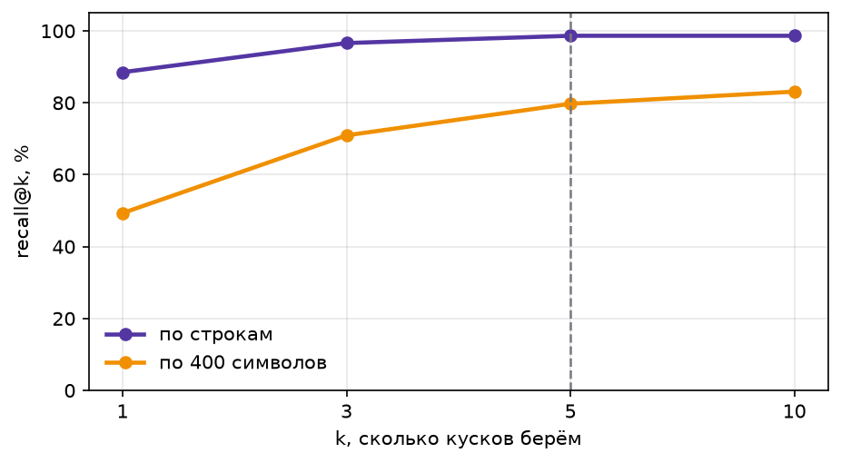
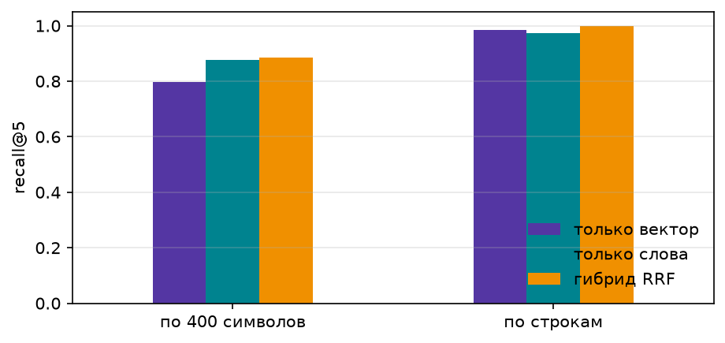
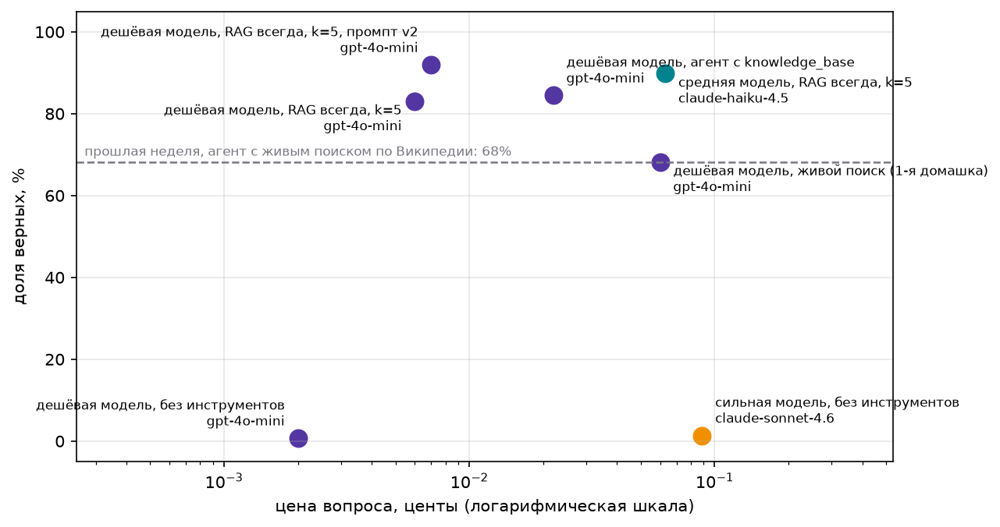
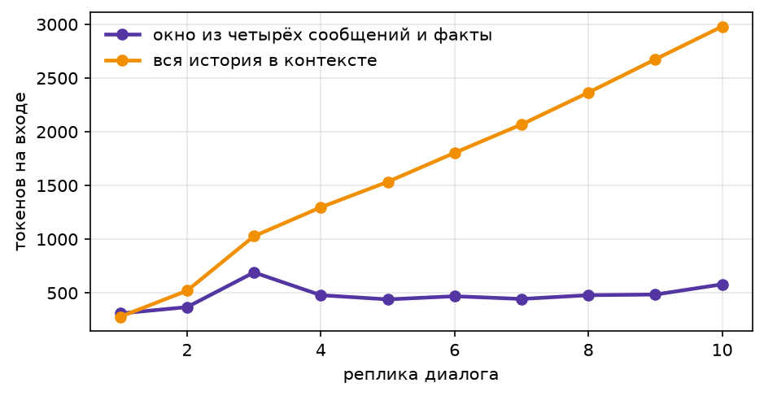

# Домашнее задание 2. База знаний и память для агента

## Что сделано

- **Корпус**: полные тексты 47 обзорных страниц англоязычной Википедии про 2026 год («2026 in Japan», «2026 in science», «2026 in politics» и т.п.), из которых собраны вопросы первой домашки. Скачивается скриптом `fetch_corpus.py` тем же API, что на семинаре: 1.02 млн символов, 7174 содержательных строки. Вопросы те же 150, что в первой домашке; в корпусе нашлась цитата у 148 (у двух страницы с тех пор изменились), они лежат в `data/questions.jsonl` в формате стартового набора. Плюс `data/unanswerable.jsonl`: 10 вопросов по теме корпуса о том, чего в нём нет (Нобелевские премии 2026, победитель Мировой серии, губернатор Калифорнии, Евровидение 2027), отсутствие проверено поиском по тексту корпуса.
- **Две нарезки**: наивная по 400 символов и осмысленная по строкам. Граница осмысленного куска проходит по переводу строки, потому что на страницах-хрониках одна строка это одно датированное событие, а заголовок раздела (месяц или тема) едет с куском как метаданные. У куска есть `page`, `section`, `url`, `line_no`: по ним человек найдёт источник. Кусков 7084 и 2577.
- **Эмбеддинги с кэшем**: `text-embedding-3-small`, 512 измерений, кэш `data/embeddings_cache.npz` по sha1 текста (10 МБ, закоммичен). Досчёт того, чего не было в кэше семинара, обошёлся в $0.003; повторный запуск ноутбука ничего не платит за эмбеддинги.
- **Milvus** через `docker-compose.yml`: standalone со встроенным etcd и локальным хранилищем, образ `milvusdb/milvus:v2.6.24`. Коллекции `lines`, `chars`, `course` (PDF) и `facts` (память); в ноутбуке фильтры по `page` и по `page` + `section`.
- **RAG-ответ**, инструмент `knowledge_base(query, page)` для агента первой домашки, замер на всех 148 вопросах и 10 без ответа, таблица отказов, разбор провалов, память с двумя сессиями и заменой факта, график токенов, тесты без модели и ключа.

## Как запустить

```
cd 2_week_memory-embed-rag
python -m venv ../.venv && source ../.venv/bin/activate
pip install -r requirements.txt
cp .env.example .env                      # OPENROUTER_API_KEY; ключ также подхватывается из ../1_week_react/practice/.env
docker compose up -d                      # Milvus на localhost:19530, первый запуск скачивает образ около 400 МБ
python fetch_corpus.py                    # корпус и вопросы (уже лежат в data/)
python -m pytest -q tests                 # 20 тестов, без модели и без ключа, память проверяется на Milvus Lite
python run_eval.py                        # прогоны всех конфигураций, результаты кэшируются в results/*.csv
python build_notebook.py --run            # собирает и выполняет homework02.ipynb
```

Без Docker: `MILVUS_URI=data/milvus_lite.db` переключает тот же код на Milvus Lite.

## Как устроен код

```
rag/hw1.py         импорт клиента, леджера, агента, реестра инструментов и is_correct из первой домашки
rag/config.py      пути, модель эмбеддингов, адрес Milvus, загрузка .env
rag/chunking.py    chunk_lines, chunk_chars, torn_example
rag/embeddings.py  EmbeddingCache: npz-кэш, досчёт пачками по 64 в три потока
rag/store.py       VectorStore над MilvusClient: index, search с фильтром, ожидание индекса; тот же код для Lite
rag/retrieval.py   поиск на numpy, is_gold, recall@k, индекс по словам с idf, RRF
rag/rag.py         RagAnswerer, PlainAnswerer, инструмент knowledge_base(query, page), AgentAnswerer
rag/memory.py      EpisodicJournal, SemanticMemory (коллекция facts), extract_facts, MemoryAssistant
rag/evaluation.py  evaluate с кэшем в csv, report, refusal_table, diagnose, строки прошлой недели
rag/viz.py, rag/pdf.py
run_eval.py        прогоны; build_notebook.py собирает и выполняет ноутбук; tests/ 20 тестов
```

Проверка ответа та же, что в первой домашке (`is_correct` с датами в обоих порядках, числами словами и границами слов), плюс правило семинара: последняя строка ответа `FINAL: <ответ>`, `NOT_FOUND` считается отказом.

## Качество поиска: recall@k по двум нарезкам

Верным считаем кусок с той же страницы, где есть ответ и не меньше половины слов цитаты. Поиск на numpy по нормализованным векторам, 148 вопросов.

| k | по строкам | по 400 символов |
|--:|--:|--:|
| 1 | 0.885 | 0.493 |
| 3 | 0.966 | 0.709 |
| 5 | 0.986 | 0.797 |
| 10 | 0.986 | 0.831 |



**Выбор k = 5.** На нарезке по строкам кривая выходит на плато уже при k=5: recall@5 и recall@10 совпадают, а каждый лишний кусок это ещё 60–80 токенов контекста на каждый вопрос. Наивная нарезка у 7 из 148 вопросов вообще не имеет верного куска: факт разрезан пополам.

## Гибрид: слова + вектор, слияние рангов RRF

Поиск по словам с idf-весами, слияние с векторным списком через RRF (1/(60+ранг)), на обеих нарезках.

| Нарезка | Поиск | recall@1 | recall@3 | recall@5 | recall@10 |
|---|---|--:|--:|--:|--:|
| по 400 символов | только вектор | 0.493 | 0.709 | 0.797 | 0.831 |
| по 400 символов | только слова | 0.743 | 0.865 | 0.878 | 0.905 |
| по 400 символов | гибрид RRF | 0.676 | 0.838 | 0.885 | 0.912 |
| по строкам | только вектор | 0.885 | 0.966 | 0.986 | 0.986 |
| по строкам | только слова | 0.912 | 0.966 | 0.973 | 0.980 |
| по строкам | гибрид RRF | 0.899 | 0.986 | 1.000 | 1.000 |



На строках гибрид даёт recall@5 = 1.0: слова добирают вопросы с точными именами и датами, которые вектору даются хуже. В замере ниже RAG работает на чистом векторном поиске Milvus, гибрид посчитан на numpy как отдельный эксперимент.

## Замер: таблица report и картинка money_chart

148 вопросов, все конфигурации с одним и тем же `is_correct`. Строка «живой поиск» перенесена из первой домашки: лучший агент прошлой недели (поиск по Википедии плюс чтение страницы) на тех же 148 вопросах.

| Конфигурация | Модель | accuracy | cost_per_task, $ | cost_per_correct, $ | поисков на вопрос |
|:--|:--|--:|--:|--:|--:|
| сильная модель, без инструментов | claude-sonnet-4.6 | 0.014 | 0.00089 | 0.06596 | 0 |
| дешёвая модель, живой поиск (1-я домашка) | gpt-4o-mini | 0.682 | 0.00060 | 0.00088 | 3.0 |
| дешёвая модель, без инструментов | gpt-4o-mini | 0.007 | 0.00002 | 0.00298 | 0 |
| дешёвая модель, RAG всегда, k=5 | gpt-4o-mini | 0.831 | 0.00006 | 0.00007 | 1 |
| дешёвая модель, агент с knowledge_base | gpt-4o-mini | 0.845 | 0.00022 | 0.00027 | 1.4 |
| средняя модель, RAG всегда, k=5 | claude-haiku-4.5 | 0.899 | 0.00063 | 0.00070 | 1 |
| дешёвая модель, RAG всегда, k=5, промпт v2 | gpt-4o-mini | 0.919 | 0.00007 | 0.00007 | 1 |



Сильная модель без инструментов с промптом этой недели («если не знаешь, ответь NOT_FOUND») честно отказывается на 139 вопросах из 148 и отвечает верно на 2: это и есть 1 % из проверки свежести. На прошлой неделе с промптом «дай самый вероятный ответ» она угадывала 11–16 %, но стоила в десять раз дороже за вопрос.

«Промпт v2» это та же конфигурация RAG после разбора провалов ниже: в правило для `FINAL:` добавлено «число вместе с единицей из источника (2 people, 13 years, 802,500 lira)».

## Отказы

| Конфигурация | Модель | Отклонено из 10 без ответа | Отклонено зря из 148 |
|:--|:--|--:|--:|
| сильная модель, без инструментов | claude-sonnet-4.6 | 10 | 139 |
| дешёвая модель, без инструментов | gpt-4o-mini | 10 | 109 |
| дешёвая модель, RAG всегда, k=5 | gpt-4o-mini | 10 | 2 |
| дешёвая модель, агент с knowledge_base | gpt-4o-mini | 10 | 5 |
| средняя модель, RAG всегда, k=5 | claude-haiku-4.5 | 10 | 3 |
| дешёвая модель, RAG всегда, k=5, промпт v2 | gpt-4o-mini | 10 | 2 |

Все конфигурации отклонили все десять вопросов без ответа. Из двух «отказов зря» у RAG один честный: вопрос fresh-87 спрашивает про цензуру президента Перу 9 января, а в корпусе событие датировано 17 февраля, ошибка в самом вопросе (отмечена ещё в первой домашке). Медиана близости лучшего куска к вопросу: 0.761 у вопросов с ответом и 0.575 у вопросов без ответа (`img/similarity.png`), так что порог по близости мог бы отсекать часть вопросов без ответа ещё до вызова модели.

## Разбор провалов лучшей дешёвой конфигурации

Первый прогон RAG на дешёвой модели (83 %) дал 25 провалов: 1 «поиск не нашёл» и 24 «нашёл, но ответ неверный». Из этих 24 сразу 14 были верными ответами без единицы измерения (`2` против `two people`, `13` против `13 years`, `802500` против `802,500 lira`): правило для `FINAL:` требовало «число цифрами», и модель послушно отбрасывала слово. Это чинится в промпте, а не в проверке: в v2 правило стало «число вместе с единицей из источника (2 people, 13 years, 802,500 lira)», 13 из 25 провалов ушли, ни один верный ответ не сломался, точность 83 → 92 % при той же цене. Дальше разбор лучшей конфигурации, v2, 12 провалов из 148 (`results/failures_best.csv`, трейсы в `results/rag_cheap_v2_traces.jsonl`):

| Кучка | Сколько | Что внутри |
|---|--:|---|
| поиск не нашёл | 1 | fresh-2 |
| нашёл, но ответ неверный | 11 | 4 числа взяты из соседней строки корпуса, где Википедия противоречит сама себе (46 против 43 погибших под Адамусом, 6300 против 2,295 в Венесуэле, 34 против 41 в Бангкоке, 252,757 против 252,756 миль); 3 расхождения формы с эталоном (`Narendra Modi` против `Prime Minister Narendra Modi`, `6 people` против `at least six`, `10 days` против `10-day`); 1 честный отказ на вопросе с ошибкой в дате (fresh-87 спрашивает про 9 января, в корпусе 17 февраля); 3 ошибки чтения (fresh-32, fresh-102, fresh-107) |

**Поиск не нашёл**, fresh-2: «Who entered negotiations with the Trump administration on March 13, 2026?», эталон Miguel Díaz-Canel. В контексте пять строк со страницы «2026 in the United States» про переговоры Трампа с Ираном (близость 0.57–0.62), а верная строка лежит на «2026 in politics»: «First Secretary of the Communist Party of Cuba Miguel Díaz-Canel entered negotiations with the Trump administration in an effort to end the embargo against Cuba». В вопросе нет ни имени, ни Кубы, и вектор тянет к Ирану. Модель честно ответила NOT_FOUND. Что менять: запрос. В векторной выдаче верная строка стоит на 17-м месте, в поиске по словам на первом (точная дата «March 13» и «Trump administration»), гибрид RRF выводит её на первое место, так что гибрид стоит включить в RAG, а не только мерить на numpy. Агент с инструментом мог бы сузить поиск фильтром `page == "2026 in politics"`, но за пять попыток искал только по «2026 in the United States» и «2026», всё время про Иран.

**Нашёл, но ответ неверный**, fresh-32: «Who won the Archibald Prize on May 8, 2026?», эталон Richard Lewer. В контексте две строки с ответом, обе первые: «Richard Lewer wins the Archibald Prize for his portrait of the Pitjantjatjara elder and artist Iluwanti Ken». Модель ответила `Iluwanti Ken`: взяла последнее имя в строке, героиню портрета вместо художника. Поиск ни при чём, это чтение. Что менять: промпт (явно попросить отвечать на «кто получил», а не «кто упомянут») или модель: Haiku с тем же контекстом ответила верно. Похожая по природе fresh-29 (46 против 43 погибших под Адамусом) промптом не лечится: обе цифры есть в корпусе на разных страницах, модель сослалась на «2026», эталон взят из «2026 in Spain». Тут менять надо либо корпус (одна каноническая страница на событие), либо проверку (принимать любое число, встречающееся в найденных источниках).

## Память

Эпизодическая память: журнал всех реплик в `data/episodes.jsonl` с сессией и временем (в `.gitignore`), в контекст не идёт. Семантическая: в конце сессии дешёвая модель получает диалог и уже известные факты и возвращает полный обновлённый список фактов, поэтому новый факт заменяет старый, а не ложится рядом. Факты лежат в отдельной коллекции Milvus `facts`, к вопросу достаются три ближайших; поиск по корпусу делается дважды, по вопросу и по вопросу с фактами, и списки сливаются через RRF.

Демонстрация в ноутбуке: в первой сессии Лена из Новосибирска рассказывает, что следит за космосом и хоккеем, и спрашивает про космос в июле. После сессии в памяти: `имя: Лена`, `город: Новосибирск`, `работа: продуктовый аналитик`, `интересы: космос, хоккей`, `пожелания к ответам: отвечай коротко`. Во второй сессии история первой в контекст не попадает, но на «что интересного случилось в моих темах за лето» агент отвечает про космос и хоккей, потому что достал факты из памяти. Затем пользователь пишет, что хоккей забросила, теперь футбол, и переехала в Калининград; после сессии в памяти: `город: Калининград` и `интересы: космос, футбол` вместо старых фактов, остальное без изменений; на вопрос «где теперь живёт Лена?» из памяти достаётся `город: Калининград`.

**График токенов.** Один и тот же диалог из десяти вопросов двумя способами.

| Режим | Реплик | Токенов на входе | Цена, $ |
|---|--:|--:|--:|
| окно из четырёх сообщений плюс факты | 10 | 4 744 | 0.00094 |
| вся история в контексте | 10 | 16 549 | 0.00177 |



**Тесты без модели** (`tests/test_memory.py`, Milvus Lite во временном файле, эмбеддинги заменены детерминированной функцией): пустая память ничего не возвращает; сохранённый факт находится по вопросу о городе; новый факт про Калининград заменяет старый про Новосибирск, в памяти остаётся один факт.

## Бонус: PDF

Лекции 4–6 и текст этого задания режутся по страницам (`rag/pdf.py`), файл и номер страницы едут метаданными, ответ ссылается на файл и страницу: `[lecture06.pdf, стр. 14]`. Из трёх вопросов по курсу в конце ноутбука два отвечены со ссылкой на файл и страницу (что такое RRF; сколько баллов за память), на третьем модель ответила NOT_FOUND, хотя нужная страница `homework02.pdf, стр. 2` была в контексте: pypdf склеивает слова на этой странице («Домашнеезадание2·дедлайн»), и модель не нашла в них цифру. Для серьёзных PDF нужен разборщик структуры, о чём и говорилось на шестой лекции.

## Вывод по тезису курса

Верный ответ стал дешевле, и сильно. На прошлой неделе лучший дешёвый агент с живым поиском по Википедии отвечал на 68 % этих же вопросов и платил 0.088 цента за верный ответ. Теперь RAG на дешёвой модели отвечает на 83 % и платит 0.007 цента за верный ответ, в 12 раз меньше. Причина одна: вместо трёх-пяти шагов агента с длинными вступлениями статей в контексте модель получает пять нужных строк и один вызов. Сильная модель без инструментов на свежих фактах не конкурент: 1 % при 6.6 цента за верный ответ.

Где тезис не подтверждается или подтверждается с оговорками:

- **Средняя модель лучше.** Haiku с тем же RAG даёт 90 % против 83 %, у неё меньше ошибок чтения. Но её верный ответ стоит в 10 раз дороже, чем у gpt-4o-mini; за те же деньги дешёвая модель может ответить десять раз.
- **Агент с инструментом не окупается на этом наборе.** «Модель сама решает, когда искать» даёт плюс 1.4 пункта за 3.6-кратную цену: на свежих вопросах искать нужно всегда, поэтому RAG перед каждым ответом и есть правильная стратегия. Агент выигрывает там, где смешаны вопросы, требующие и не требующие поиска.
- **Потолок это чтение, а не поиск.** Recall@5 = 0.986, а точность 0.83: из 25 провалов только один на совести поиска. Половина остального это единица измерения в эталоне, и это дешевле всего чинить промптом, что видно по строке v2.

## Цена

| Что | $ |
|---|--:|
| эмбеддинги корпуса, вопросов и PDF | 0.004 |
| Sonnet без инструментов, 158 вопросов | 0.132 |
| gpt-4o-mini без инструментов, RAG, агент, RAG v2 | 0.055 |
| Haiku RAG | 0.094 |
| ноутбук: живые примеры, память, график токенов, PDF | 0.005 |
| всего | 0.29 |

Цены точные, из поля `usage.cost` OpenRouter, по каждому вопросу в `results/*.csv`. Ключ в истории коммитов не появлялся, `.env`, журнал `episodes.jsonl`, `facts.json` и `milvus_data/` в `.gitignore`.
